  

 

## 👋 About Me

- 🔭 Building backend systems and integrations in **Go** and **Python** — recent work spans ERP master-data integration and security/auditing tooling
- 🤖 Exploring AI tooling — experimenting with MCP (Model Context Protocol) servers and text-to-speech pipelines
- 🛡️ Drawn to security-minded, automation-heavy side projects
- 🎓 *(Add a line here about your current role — student, job title, or what you're focused on right now)*
- ⚡ Fun fact: some of my code lives in the [GitHub Arctic Code Vault](https://archiveprogram.github.com/) ❄️
- 📫 Reach me through the links at the bottom of this page

 

## 🛠️ Tech Stack

 

## 🚀 Featured Projects

 

## 📊 GitHub Stats

 

  

 

## 🏆 Trophies

 

## 🐍 Contribution Snake

<i>One-time setup needed — see <code>snake-workflow.yml</code> in the same folder as this README.</i>

 

## 🤝 Connect With Me

 

