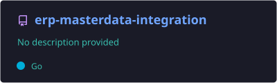
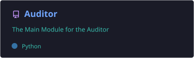
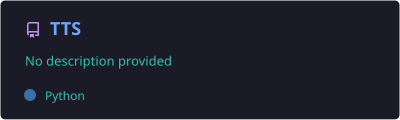
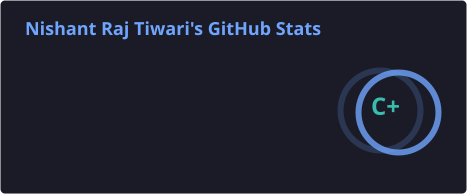
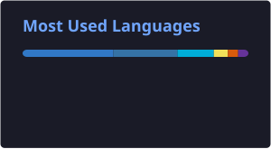
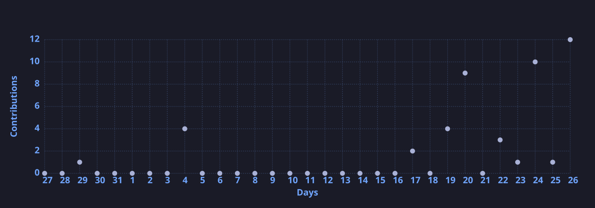

  

 

## 👋 About Me

- 🔭 Building backend systems and integrations in **C/C++** **Node** and **Python** — I do enjoy a bit of unexplored territory but I will crash and burn :D
- 🤖 AI Paglu — RAG, RL and Agentic Systems
- 🛡️ Drawn to security! Love exploring exploits and red-team stuff, and sprinkle that with a bit of Distributed systems 
- 🎓 Education in Electronics and Telecommunications systems with a profound abomination for my Professors <3, but the the subjects were cool
- ⚡ Fun fact: some of my code lives in the [GitHub Arctic Code Vault](https://archiveprogram.github.com/) ❄️ but I live in Pune
- 📫 Reach me through the links at the bottom of this page

 

## 🛠️ Tech Stack

 

<b>📦 Full stack breakdown (click to expand)</b>

 

**Languages**

**Frontend**

**Backend / Frameworks**

**Databases & Search**

**AI / ML / Agentic Systems**

**Cloud & DevOps**

**Observability & Infra Tooling**

**Distributed Systems & Data Structures**

**Security & Auth**

**Protocols & Networking**

**Concepts**

**Misc Tools**

 

## 🚀 Featured Projects

 

## 📊 GitHub Stats

 

  

 

## 🏆 Trophies

 

## 🐍 Contribution Snake

<i>Eat Code Sleep and dont use punctuations</i>

 

## 🤝 Connect With Me

 

