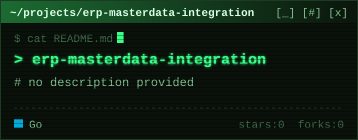
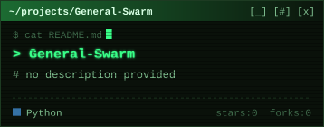
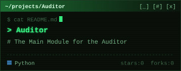
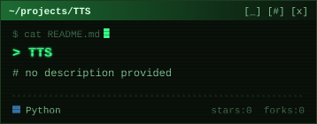
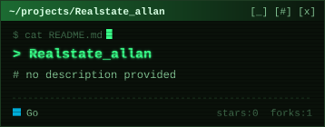
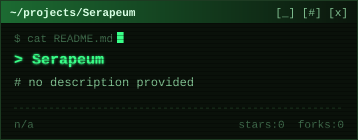
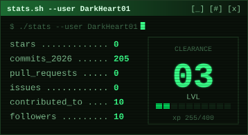
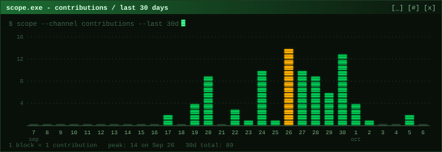
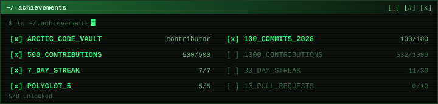

```text
████████╗██╗████████╗ █████╗ ███╗   ██╗
╚══██╔══╝██║╚══██╔══╝██╔══██╗████╗  ██║
   ██║   ██║   ██║   ███████║██╔██╗ ██║
   ██║   ██║   ██║   ██╔══██║██║╚██╗██║
   ██║   ██║   ██║   ██║  ██║██║ ╚████║
   ╚═╝   ╚═╝   ╚═╝   ╚═╝  ╚═╝╚═╝  ╚═══╝

  nishant raj tiwari  ::  backend & systems  ::  automation + security

┌──(nishant@darkheart01)-[~]
└─$ neofetch
│
├─ OS ........ human (pune build, caffeinated)
├─ HOST ...... Pune, India
├─ SHELL ..... bash / zsh / vibes
├─ LANGS ..... Go, Python, TypeScript, C/C++
├─ FOCUS ..... RAG, RL, agentic systems, security
├─ UPTIME .... since the GitHub Arctic Code Vault
└─ STATUS .... [ONLINE] will crash and burn for fun
```

<div align="center">


<br/>


</div>

<br/>

## `$ whoami`

- **[+]** Building backend systems and integrations in **C/C++**, **Node** and **Python**. I enjoy a bit of unexplored territory, even if I crash and burn :D
- **[+]** AI Paglu: RAG, RL and agentic systems.
- **[+]** Drawn to security. Exploits, red-team stuff, sprinkled with a bit of distributed systems.
- **[+]** Educated in Electronics and Telecommunications, with a profound abomination for my professors <3 (the subjects were still interesting).
- **[+]** Fun fact: some of my code lives in the [GitHub Arctic Code Vault](https://archiveprogram.github.com/) ❄️ and I live in Pune <3
- **[+]** Reach me through the links at the bottom of this page.

<br/>

## `$ cat ~/.stack`

<div align="center">

</div>

<details>
<summary><b>$ cat ~/.stack --verbose</b></summary>

```text
[languages]
  Python · Go · TypeScript · JavaScript · C/C++ · Java · Dart · SQL · x64 Assembly

[frontend]
  React 18/19 · Next.js · React Native · Flutter · Vite · Tailwind CSS
  Redux/RTK · Zustand · Riverpod · GoRouter · Dio · Monaco Editor

[backend]
  Django 5 + DRF · FastAPI · Express.js · Spring Boot 3 · chi (Go router)
  Node.js · Wails · Win32 API · Windows Native API (ntdll.dll)
  Windows Driver Kit (WDK)

[data]
  PostgreSQL (+PostGIS, pgvector) · MongoDB · Neo4j · Redis · SQLite · AstraDB
  Firebase Firestore · BigQuery · Elastic Stack (ELK) · ChromaDB · FAISS

[ai/ml]
  LLMs · Transformers · RAG pipelines · Multi-agent / agentic systems
  Groq · Claude (via OpenRouter) · Gemini Pro · Gemma · Mistral-7B · Llama
  Sentence Transformers · NLP · Predictive modeling · CHGNet · ESM-2
  BoTorch (Bayesian opt.) · Stable-Baselines3 (PPO/RL) · β-VAE
  Vertex AI · MLflow

[cloud/devops]
  Docker · Docker Compose · Kubernetes · KEDA · Git/GitHub · GitHub Actions
  Linux · nginx · Nginx Proxy Manager · Vercel
  GCP (Cloud Run, GCS, Functions, Scheduler, Vertex AI, Vision)
  AWS (SQS, Lightsail)

[observability]
  Prometheus · Grafana · Loki · Promtail · Tempo · Alertmanager
  Temporal · Asynq (Go job queue) · Uptime Kuma

[distributed/algos]
  Leader election (Redis lease) · Tarjan's SCC · NetworkX · Graph algorithms
  Message queues (SQS, Redis pub/sub) · Event-driven architecture

[security/auth]
  OAuth 2.0 · JWT · RBAC · Secret scanning · SAST · Dependency auditing
  CVE matching / vuln scanning · Blockchain (Polygon, smart contracts)
  IPFS / Pinata

[protocols]
  REST · WebSockets · IMAP/SMTP · gRPC · W3C TraceContext (OTLP)

[concepts]
  OOP · DSA (300+ problems) · System design · Microservices
  CI/CD · TDD (testcontainers, golangci-lint)

[misc]
  Figma · Claude Code · WAHA (WhatsApp HTTP API) · APScheduler
  Fast2SMS · Twilio (SMS/WhatsApp) · PagarBook API
```

</details>

<br/>

## `$ ls -la ~/projects`

<div align="center">

<a href="https://github.com/DarkHeart01/erp-masterdata-integration"></a>
<a href="https://github.com/BreakingEnigmaVIT/General-Swarm"></a>
<a href="https://github.com/ArgusPanipath/Auditor"></a>
<a href="https://github.com/MyMindSpace/TTS"></a>
<a href="https://github.com/DarkHeart01/Realstate_allan"></a>
<a href="https://github.com/ET-Hackathon/Serapeum"></a>

</div>

<br/>

## `$ ./stats.sh`

<div align="center">




<br/>


<br/>



</div>

<br/>

## `$ ls ~/.achievements`

<div align="center">

</div>

<br/>

## `$ ./snake --eat-contributions`

<div align="center">

</div>

<br/>

## `$ fortune`

```text
"Eat Code Sleep and dont use punctuations"
```

<br/>

## `$ ssh nishant@everywhere`

<div align="center">

<a href="https://www.linkedin.com/in/nishant-raj-tiwari-7b66aa16b/"></a>
<a href="https://x.com/NishantRajTiwa3"></a>
<a href="mailto:nishant@nrg.it.com"></a>
<a href="https://nrg.it.com"></a>

</div>

<br/>

```text
Last login: Thu Oct  1 2026 from pune
[ EOF ]  best viewed at 1024x768 in a terminal near you
```


